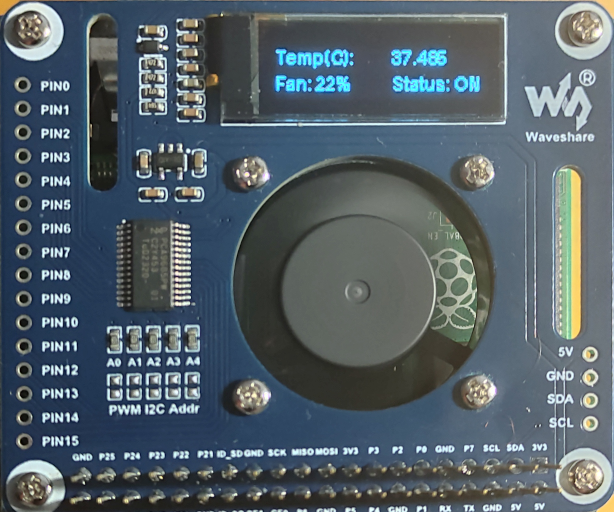

# Waveshare PWM Controlled Fan HAT Home-Assistant Addon

Specifically for this FAN-HAT: <https://www.waveshare.com/wiki/Fan_HAT>


Home Assistant (HASS) Addon to support the Waveshare PWM Controlled Fan HAT



## Example Configuration

These options can be set in your add-on configuration:

```yaml
fan_min_temp: 25        # Minimum temperature (°C) to start the fan
fan_max_temp: 80        # Maximum temperature (°C) for full fan speed
delta_temp: 5           # Minimum temperature change to trigger update
update_interval: 2      # Update interval in seconds
rotate_oled: false      # Rotate the OLED display (true/false)
```

Important: Enable I2C first to make this work. This can be done in a couple of ways, either as described
at <https://www.home-assistant.io/common-tasks/os/#enable-i2c> or use the HassOS I2C Configurator
from <https://github.com/adamoutler/HassOSConfigurator>.

